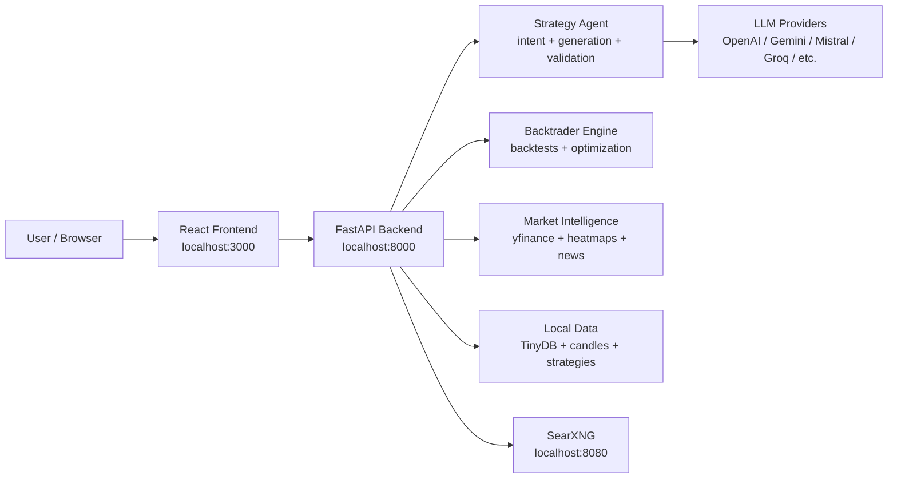

# TradingSpy

> Local-first AI trading research: market heatmaps, news catalysts, strategy generation, Backtrader backtests, and transparent agent runs in one Docker app.

Screenshot/GIF slot: add `docs/screenshot.png` or `docs/demo.gif` before publishing the repo.

TradingSpy is an open-source research workstation for traders and builders who want to ask questions, inspect market context, generate strategy ideas, and test them against real historical candles without wiring together five separate tools.

It is not a broker and it does not place trades. It is a local research environment for analysis, backtesting, and strategy iteration.

## Why People Star It

- Chat with your market data, strategies, news, heatmaps, and backtest history.
- Generate Backtrader strategies with an agent that validates code, rejects zero-trade results, and compares against buy-and-hold or a baseline strategy.
- See the agent work in public: data freshness, market context, candidate generation, validation failures, backtests, benchmark deltas, and stale/offline states.
- Run local Docker services with persistent data under `backend/data/`.
- Use multiple LLM providers: OpenAI, OpenRouter, Groq, Google AI Studio, Mistral, Azure, AWS Bedrock, and Google Vertex AI.
- Use the backend as an OpenAI-compatible local API for agentic trading research clients.

## Demo Prompts

Try these after starting the app:

```text
Generate until it beats buy and hold for QQQ. Use daily candles.
```

```text
Improve EMA_Trend for TQQQ using daily candles. Generate until it beats EMA_Trend, not buy and hold.
```

```text
Explain why the Market Overview heatmap looks like this for timeframe 1D. Use current heatmap data and fresh news.
```

```text
Generate a strict RSI + volume + breakout strategy for SMH this year, but reject anything with zero trades.
```

## Features

### AI Strategy Agent

- LLM-routed intent detection for strategy creation, strategy improvement, backtesting, data tasks, and normal analysis chat.
- Multi-round strategy generation with validation before backtest.
- Benchmarks against buy-and-hold or a selected baseline strategy.
- Rejects inactive zero-trade strategies instead of treating `0% ROI` as meaningful.
- Shows live progress: model calls, validation checks, strategy saves, optimization combinations, runtime errors, and rejection reasons.
- Supports agent instructions, answer budget, run detail, and custom battle parameters.

### Backtesting And Optimization

- Backtrader-powered local backtests.
- Parallel or sequential execution.
- Stake range and trailing-stop matrix.
- Start date, end date, initial capital, and commission controls.
- Buy-and-hold benchmark comparison.
- Strategy battle views with capped selection for faster experiments.

### Market Intelligence

- Market overview and industry/sector heatmaps.
- ETF proxy group analysis.
- News and catalyst lookup through local SearXNG/web search tooling.
- Watchlist sync and dataset freshness checks.
- Daily, intraday, and longer-window candle data support.

### Local App Experience

- React dashboard with chat, terminal, strategy library, backtesting, market intelligence, and settings.
- Persistent local data in `backend/data/`.
- Docker Compose setup for backend, frontend, and SearXNG.
- OpenAI-compatible `/v1/chat/completions` and `/v1/models` endpoints.
- CLI and Telegram bot folders for extension points.

## Quick Start

### 1. Clone

```bash
git clone https://github.com/your-org/tradingspy.git
cd tradingspy
```

### 2. Configure

```bash
cp .env.example .env
```

Add at least one LLM provider key to `.env`, for example:

```bash
OPENAI_API_KEY=sk-your-key
DEFAULT_PROVIDER=openai
DEFAULT_MODEL=gpt-4o
```

You can also configure providers inside the app settings.

### 3. Run

```bash
docker compose up -d --build
```

Open:

- App: [http://localhost:3000](http://localhost:3000)
- Backend API: [http://localhost:8000](http://localhost:8000)
- API docs: [http://localhost:8000/docs](http://localhost:8000/docs)
- SearXNG: [http://localhost:8080](http://localhost:8080)

### 4. Stop

```bash
docker compose down
```

## Manual Development

Backend:

```bash
cd backend
pip install -r requirements.txt
uvicorn main:app --reload --host 0.0.0.0 --port 8000
```

Frontend:

```bash
cd frontend
npm install
npm run dev
```

## Architecture



## Data Layout

Runtime data is intentionally local and ignored by git:

```text
backend/data/
├── db.json
├── system_settings.json
├── market_data/local_user/
├── strategies/local_user/
├── results/local_user/
├── optimization_history/
└── temp_datas/
```

Only `.gitkeep` placeholders and example JSON files should be committed from `backend/data/`.

## OpenAI-Compatible API

TradingSpy exposes local OpenAI-style endpoints:

```bash
curl http://localhost:8000/v1/models
```

```bash
curl http://localhost:8000/v1/chat/completions \
  -H "Content-Type: application/json" \
  -d '{
    "model": "trading-ai-strands",
    "stream": true,
    "messages": [
      { "role": "user", "content": "Is TQQQ strong today? Use market context." }
    ]
  }'
```

Model IDs:

| Model ID | Mode | Behavior |
| --- | --- | --- |
| `trading-ai` | Manual | Plain assistant mode; suggests actions without tool execution |
| `trading-ai-manual` | Manual | Same as `trading-ai` |
| `trading-ai-agentic` | Agentic | Executes tools with streaming progress |
| `trading-ai-strands` | Agentic loop | Iterative tool loop used by the UI default |

Streaming is recommended for agentic modes.

## Configuration

Common `.env` values:

```bash
OPENAI_API_KEY=
OPENROUTER_API_KEY=
GROQ_API_KEY=
GOOGLE_AI_STUDIO_API_KEY=
GEMINI_API_KEY=
MISTRAL_API_KEY=
AZURE_OPENAI_API_KEY=
AZURE_OPENAI_ENDPOINT=
AZURE_OPENAI_API_VERSION=
AWS_ACCESS_KEY_ID=
AWS_SECRET_ACCESS_KEY=
AWS_REGION=
GCP_PROJECT=
GCP_LOCATION=
DEFAULT_PROVIDER=openai
DEFAULT_MODEL=gpt-4o
```

The Docker backend also passes `SEARXNG_URL=http://searxng:8080`.

## Safety And Limits

- TradingSpy is for research and education only.
- It does not provide financial advice.
- Backtests can overfit and do not predict future returns.
- Generated strategies must be reviewed before any real-world use.
- Keep API keys out of git. Use `.env` or your own secret manager.

## Troubleshooting

Check services:

```bash
docker compose ps
curl http://localhost:8000/health
curl http://localhost:3000
```

View logs:

```bash
docker compose logs -f backend
docker compose logs -f frontend
docker compose logs -f searxng
```

Rebuild:

```bash
docker compose build --no-cache
docker compose up -d
```

If Docker reports no space left on device, prune unused build cache and images with care:

```bash
docker system df
docker builder prune
```

## Roadmap

- More deterministic strategy templates for common regimes.
- Better benchmark memory across chat threads.
- Exportable backtest reports.
- More provider-specific streaming support.
- Sharable demo screenshots and walkthrough GIFs.
- Optional auth for hosted deployments.

## Contributing

Good first contributions:

- Add a screenshot or short demo GIF to `docs/screenshot.png`.
- Improve strategy validation rules.
- Add regression tests for agent routing and stale-run behavior.
- Improve docs for provider setup.
- Add new market intelligence tools.

Development loop:

```bash
npm run build --prefix frontend
python3 -m py_compile backend/main.py
docker compose up -d --build
```

Open an issue with:

- What you asked the assistant.
- The agent run ID, if any.
- Backend logs around the failure.
- Dataset/ticker/timeframe.

## License

License not declared yet. Add a `LICENSE` file before publishing broadly.

## Disclaimer

TradingSpy is experimental software. It is not investment advice, a trading signal service, or a guarantee of performance. You are responsible for reviewing all generated code, assumptions, data quality, and results.
