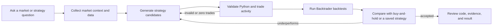
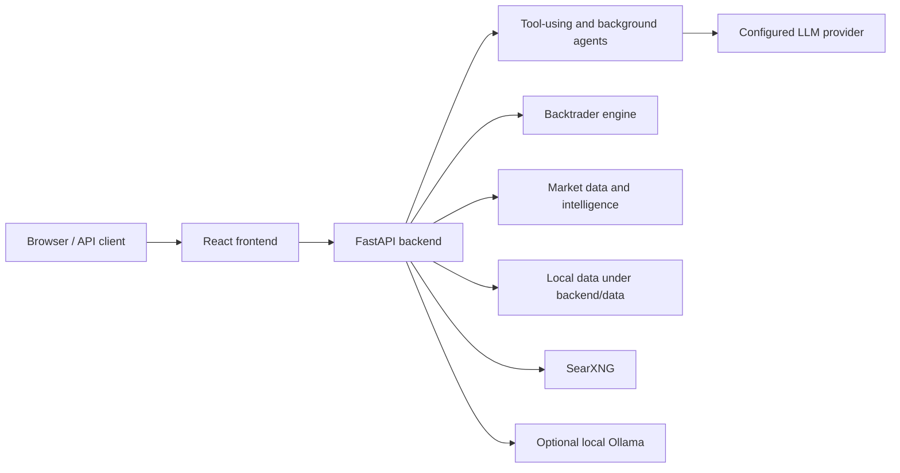

# TradingSpy

**An AI trading research workbench that shows its work—and tests its ideas.**

Explore market context, generate Backtrader strategies, and verify them against real historical candles in one local Docker Compose stack. TradingSpy does not connect to a brokerage or place trades.

[Quick Start](#quick-start-with-docker) · [How It Works](#how-it-works) · [First Run](#first-run) · [Local Development](#local-development-without-docker) · [API](#openai-compatible-api) · [Contributing](#contributing)

## Highlights

- Tool-using market assistant with transparent agent runs and progress.
- Market, sector, industry, news, insider, and technical context.
- Backtrader strategy generation, validation, optimization, and benchmark comparisons.
- Local data storage with no hosted TradingSpy account required.
- Google AI Studio, Mistral, OpenRouter, LiteLLM, and local Ollama support.
- OpenAI-compatible local API for scripts and other agent clients.

## How It Works

TradingSpy turns a research request into an inspectable workflow instead of returning an unsupported answer and calling it done.



The Task Center keeps the plan, progress, tool calls, validation failures, benchmark target, and accepted result visible while longer workflows run.

## Quick Start With Docker

This is the recommended installation path.

### Prerequisites

- Git.
- Docker Desktop, or Docker Engine with Docker Compose v2.
- An API key for a hosted LLM provider, or a local Ollama installation. The app starts without either, but AI features require one configured model.

### 1. Clone and configure

```bash
git clone https://github.com/mrhustlex/TradingSpy.git
cd TradingSpy
cp .env.example .env
```

Open `.env` and add one provider key. Google AI Studio is the default:

```bash
GOOGLE_AI_STUDIO_API_KEY=your-key
DEFAULT_PROVIDER=google_ai_studio
DEFAULT_MODEL=gemini-2.5-flash
```

You may leave the keys blank and configure a provider later from the app's Settings page.

To use Ollama instead of a hosted provider, [install Ollama](https://docs.ollama.com/quickstart), pull a model, and configure the local provider:

```bash
ollama pull qwen2.5-coder:7b
```

Set these values in `.env`:

```bash
DEFAULT_PROVIDER=ollama
DEFAULT_MODEL=qwen2.5-coder:7b
OLLAMA_BASE_URL=http://host.docker.internal:11434/v1
```

Ollama normally runs in the background after installation. If needed, start it manually with `ollama serve` before starting TradingSpy.
TradingSpy connects through Ollama's [OpenAI-compatible API](https://docs.ollama.com/api/openai-compatibility).

### 2. Start TradingSpy

```bash
docker compose up -d --build
```

The first build downloads the application dependencies. Later starts use the Docker cache.

Check that all three services are healthy:

```bash
docker compose ps
```

Open:

- TradingSpy: <http://localhost:3000>
- API documentation: <http://localhost:8000/docs>
- SearXNG: <http://localhost:8080>

### 3. Stop or update

```bash
# Stop the application without deleting local data
docker compose down

# Pull updates and rebuild
git pull
docker compose up -d --build
```

Runtime data remains under `backend/data/`.

## Local Development Without Docker

Use this path when you want hot reload or plan to change the code.

### Prerequisites

- Python 3.11. Python 3.13 is not currently supported by the data-science dependency set.
- Node.js 22 and npm.
- Git.
- Docker is optional for SearXNG-backed web/news search.

### 1. Clone and configure

```bash
git clone https://github.com/mrhustlex/TradingSpy.git
cd TradingSpy
cp .env.example backend/.env
```

Add one provider key to `backend/.env`, or configure it later in the UI.

For local Ollama development, no key is required:

```bash
ollama pull qwen2.5-coder:7b
```

Then set the following in `backend/.env`:

```bash
DEFAULT_PROVIDER=ollama
DEFAULT_MODEL=qwen2.5-coder:7b
OLLAMA_BASE_URL=http://localhost:11434/v1
```

### 2. Start the backend

Run in the first terminal:

```bash
cd backend
python3.11 -m venv .venv
source .venv/bin/activate
python -m pip install --upgrade pip
python -m pip install -r requirements.txt
uvicorn main:app --reload --host 127.0.0.1 --port 8000
```

On Windows PowerShell, activate the environment with:

```powershell
.venv\Scripts\Activate.ps1
```

Confirm the backend is ready at <http://localhost:8000/health>.

### 3. Start the frontend

Run in a second terminal from the repository root:

```bash
cd frontend
npm ci
npm run dev
```

Open <http://localhost:5173>.

### 4. Optional: start local web search

News and Web Research prefer SearXNG. SearXNG is **not Docker-only**: TradingSpy only needs a reachable SearXNG HTTP service. It may run as a native service, on another machine, or from the bundled Compose service.

If Docker Desktop or Docker Engine is running, the easiest repository-supported local-dev option is the npm helper from the repository root:

```bash
npm run dev:searxng
npm run health:searxng
```

This starts only SearXNG at <http://localhost:8080>; it does not start the backend or frontend containers. To stop it:

```bash
npm run stop:searxng
```

The equivalent Docker command is:

```bash
docker compose up -d searxng
```

For a separately managed SearXNG instance, configure its base URL in `backend/.env`:

```bash
SEARXNG_URL=http://localhost:8080
```

The rest of TradingSpy works when SearXNG is unavailable, but **Web Research** needs a working search provider. The DuckDuckGo fallback may be unavailable or return no results. Direct arXiv search remains available when Research Papers is selected.

Web Research reads adaptively. It first skims each selected page or paper abstract, checks whether it found concrete entry, exit, indicator, risk, and validation evidence, and deep-reads only sources that need more detail. For arXiv papers it can continue into the PDF. Reading is deliberately bounded (up to 12,000 extracted characters and 20 PDF pages per source), and only relevant passages are supplied to the strategy model.

If every public search provider is temporarily unavailable, generation continues without citations instead of failing the job. The Studio labels this fallback clearly; it never invents or implies sources that were not read.

### Expected Pattern forecasts

Ask the Assistant for an expected pattern, projected trend, forecast chart, or forecast CSV for a symbol and timeframe—for example, `Show the expected pattern for QQQ over the next 20 daily bars`. It reads recent OHLCV bars, derives momentum, trend, mean-reversion, RSI, volume, and volatility context, then renders a central path with an 80% uncertainty band. The card includes one-click CSV export. Forecasts are reproducible statistical scenarios based on historical bars, not guaranteed prices or financial advice.

## Provider Configuration

Keys may be stored in `.env`/`backend/.env` or entered in Settings. Never commit a real key.

| Provider | Environment variable | Example default model |
| --- | --- | --- |
| Google AI Studio | `GOOGLE_AI_STUDIO_API_KEY` | `gemini-2.5-flash` |
| Mistral | `MISTRAL_API_KEY` | `mistral-large-latest` |
| OpenRouter | `OPENROUTER_API_KEY` | `openai/gpt-4o-mini` |
| LiteLLM | `LITELLM_API_KEY`, `LITELLM_BASE_URL` | Your proxy's model ID |
| Ollama (local) | `OLLAMA_BASE_URL`; no API key | `qwen2.5-coder:7b` |

See [.env.example](.env.example) for every supported setting.

## First Run

The quickest end-to-end check is:

```text
Download daily QQQ data for one year, then generate candidates until one beats buy and hold. Reject anything with zero trades.
```

Then:

1. Open the Task Center and watch the workflow collect data, generate candidates, and backtest them.
2. Inspect rejected candidates instead of treating failures as hidden retries.
3. Review the accepted strategy code and its benchmark comparison.
4. Select **Continue** to make the next run improve on the accepted version.

Other useful prompts:

```text
Explain today's market and strongest sectors using current heatmap data and fresh news.
```

```text
Generate candidates until one beats buy and hold for QQQ. Reject strategies with zero trades.
```

```text
Find undervalued profitable semiconductor stocks and explain the evidence.
```

## What TradingSpy Includes

### Research and market intelligence

- Market overview, sector and industry heatmaps, watchlists, and ticker charts.
- News and catalyst search through the local SearXNG service.
- Fundamentals, insider activity, technical context, and data-freshness checks.
- Daily, intraday, and extended-hours candle downloads.

### Strategy research

- Backtrader-powered backtests and parameter optimization.
- AI-generated strategies with syntax and runtime validation.
- Zero-trade rejection and buy-and-hold or saved-strategy benchmarks.
- Persistent strategy, result, and optimization history.

### Agent interfaces

- Interactive tool-using assistant for short research questions.
- Persistent background workflows for strategy races, market reviews, and screens.
- OpenAI-compatible `/v1/chat/completions` interface.
- Optional ACP and A2A outputs for trusted local integrations.

## Supported Markets And Symbols

TradingSpy uses Yahoo Finance-compatible symbols for candle downloads and market context. Examples include:

| Market | Examples |
| --- | --- |
| United States | `AAPL`, `NVDA`, `QQQ`, `SPY` |
| London | `AZN.L`, `HSBA.L` |
| Hong Kong | `0700.HK` |
| Japan | `7203.T` |
| India | `RELIANCE.NS` |
| Canada | `SHOP.TO` |
| Australia | `BHP.AX` |
| Crypto pairs | `BTC-USD`, `ETH-USD` |

Availability, history depth, fundamentals, insider records, and intraday intervals vary by symbol and upstream data source.

## Architecture



The Docker setup binds all services to `127.0.0.1`:

| Service | Address |
| --- | --- |
| Frontend | `http://localhost:3000` |
| Backend | `http://localhost:8000` |
| SearXNG | `http://localhost:8080` |

## Local Data

TradingSpy stores runtime data locally:

```text
backend/data/
├── db.json
├── system_settings.json
├── market_data/local_user/
├── strategies/local_user/
├── results/local_user/
├── optimization_history/
└── temp_datas/
```

These files are ignored by Git. Back them up separately if the results matter to you.

## OpenAI-Compatible API

List the available adapter modes:

```bash
curl http://localhost:8000/v1/models
```

Send a streaming request:

```bash
curl http://localhost:8000/v1/chat/completions \
  -H "Content-Type: application/json" \
  -d '{
    "model": "trading-ai-strands",
    "stream": true,
    "messages": [
      {"role": "user", "content": "Is QQQ strong today? Use market context."}
    ]
  }'
```

`trading-ai-strands` is the recommended tool-using adapter. `trading-ai` and `trading-ai-manual` provide plain responses, while `trading-ai-agentic` remains for compatibility.

## Troubleshooting

### A service does not become healthy

```bash
docker compose ps
docker compose logs --tail=200 backend
docker compose logs --tail=200 frontend
docker compose logs --tail=200 searxng
```

### A port is already in use

TradingSpy needs local ports `3000`, `8000`, and `8080`. Stop the conflicting process or change the host-side port in `docker-compose.yml`.

### The assistant says no provider is configured

Add a key to `.env` and recreate the backend:

```bash
docker compose up -d --force-recreate backend
```

Alternatively, save the key from Settings in the application.

### Ollama cannot be reached

Confirm Ollama is running and the selected model is installed:

```bash
ollama list
ollama pull qwen2.5-coder:7b
curl http://localhost:11434/api/tags
```

For Docker, keep `OLLAMA_BASE_URL=http://host.docker.internal:11434/v1`. For a backend running directly on the host, use `http://localhost:11434/v1`. If Ollama only listens on loopback inside another machine or container, expose it deliberately and review the security implications first.

### Web Research says no sources were found

Open Web Research and check its search-service status notice. If SearXNG is unavailable, either start the bundled service:

```bash
docker compose up -d searxng
```

Or run SearXNG separately and set `SEARXNG_URL` in `backend/.env`. Docker is optional; only a reachable SearXNG HTTP service is required. DuckDuckGo is a best-effort fallback and is not guaranteed to return results.

### The frontend opens but the API is unavailable

Check <http://localhost:8000/health>. For local development, make sure the backend terminal is still running and uses port `8000`.

### Docker runs out of disk space

Inspect usage before removing unused build cache:

```bash
docker system df
docker builder prune
```

## Development Checks

```bash
python3 -m py_compile backend/main.py backend/modules/*.py
npm run build --prefix frontend
docker compose config --quiet
```

The direct Python dependencies live in `backend/requirements.in`; `backend/requirements.txt` is the generated lock file used by Docker and local installs.

## Reproducibility

TradingSpy separates evidence that can be reproduced from output that naturally changes:

- A saved strategy run against the same local candles, dates, capital, commission, and parameters should produce the same backtest result.
- LLM-generated strategy code is non-deterministic and can differ between runs, even with the same prompt.
- Live quotes, fundamentals, insider records, heatmaps, and news change over time.
- Model aliases and upstream provider behavior may change. Use an explicit model ID when comparing experiments.
- Backtest performance depends on the selected period and assumptions; it is not a promise of future returns.

Keep the dataset, generated strategy, benchmark, and run details together when sharing a result.

## Safety

- TradingSpy is experimental research software, not financial advice or a trading signal service.
- Backtests can overfit and do not predict future returns.
- Generated strategy Python is executed locally and is not sandboxed. Review it before running it.
- Keep all services bound to localhost unless you add authentication, TLS, network controls, and process isolation.
- Keep credentials out of Git and rotate any key that has ever been committed.

See [SECURITY.md](SECURITY.md) for the full security policy.

## Contributing

Contributions are welcome. Start with [CONTRIBUTING.md](CONTRIBUTING.md), review current work in [CHANGELOG.md](CHANGELOG.md), and use [SUPPORT.md](SUPPORT.md) when reporting a problem.

## License

TradingSpy is available under the [MIT License](LICENSE).
