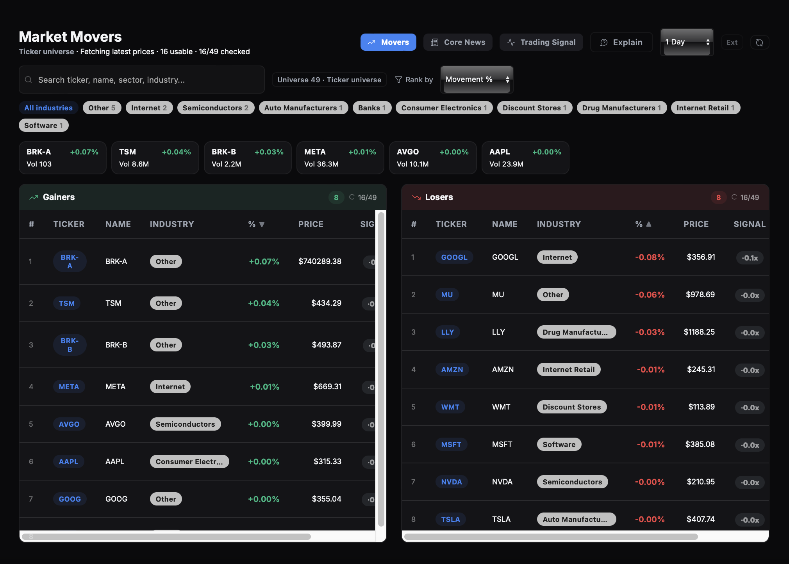
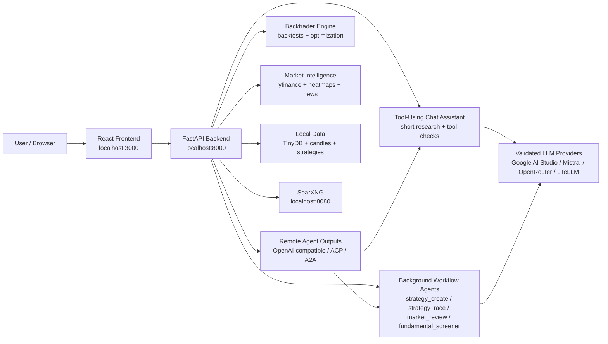

## Trading Spy

> Local-first AI trading research: market heatmaps, news catalysts, strategy generation, Backtrader backtests, and transparent agent runs in one Docker app.

TradingSpy is an open-source research workstation for traders and builders who want to ask questions, inspect market context, generate strategy ideas, and test them against real historical candles without wiring together five separate tools.

It is not a broker and it does not place trades. It is a local research environment for analysis, backtesting, and strategy iteration. Fully open-source, zero data privacy concerns, and free of charge.

<p align="center">
  <a href="https://mrhustlex.github.io/tradingspy">
    
  </a>
  <a href="https://buymeacoffee.com/mrhustlex">
    
  </a>
</p>

---

## What Could You Do with TradingSpy?

- **Trading Companion** — Chat with your market data, strategies, news, heatmaps, and backtest history.
- **Strategy Researcher** — Research to find the best trading strategies until it beats the baseline strategy.
- **Trading Trend Prediction** — Leverage calculation and LLM with the support and resistance lines to simulate expected stock trend.
- **Trading Signal Analysis** — The tool analyzes the real-time movement, incorporates peer stocks, insider trading information, and trading indicators.

---

## Key Design

TradingSpy is designed with a hybrid approach: traditional data visualisation for quick, deterministic results combined with loop-engineering-powered agents as a trading companion.

### Features

| Feature | What it does |
| --- | --- |
| **Market Intelligence** | Real-time quotes, sector heatmaps, industry performance, insider activity, news search, and fundamentals — all in one query. |
| **AI Strategy Generation** | Describe a trading thesis in plain English; get a working Backtrader strategy with syntax and runtime validation. |
| **Automated Backtesting** | Every generated strategy is backtested against downloaded candles with configurable parameter sweeps. |
| **Benchmark Comparison** | Every result is compared to buy-and-hold and any saved strategy. Underperformers are rejected automatically. |
| **Loop Engineering** | Set a goal ("beat buy-and-hold", "find undervalued semiconductors") and the agent iterates until it succeeds — no babysitting required. |
| **Transparent Agent Runs** | Every tool call, validation failure, rejection reason, and accepted result is logged and visible in the Task Center. |
| **Multi-Provider LLM** | Google AI Studio, Mistral, OpenRouter, NVIDIA, LiteLLM, Ollama (local), AWS Bedrock, GCP Vertex AI, and Azure OpenAI. |
| **OpenAI-Compatible API** | Use TradingSpy as a backend for scripts, other agents, or custom integrations via `/v1/chat/completions`. |
| **Local-First Architecture** | All data stored under `backend/data/`. No external accounts, no telemetry, no cloud dependency. |

### Agents

| Agent | Example Prompt | What it does |
| --- | --- | --- |
| **Strategy Race** | `Generate until it beats buy and hold for QQQ. Use daily candles.`<br><br>`Improve EMA_Trend for TQQQ using daily candles. Generate until it beats EMA_Trend, not buy and hold.` | Generates strategies based on selected modes (tick data, research papers, etc.) from the AI Strategy Studio. Improves or compares strategies over rounds — can use a previous accepted version or selected baseline, generate candidates, backtest them, and accept only versions that beat the target benchmark. |
| **Signal Analysis** | `Predict the next move for btc-usd for daily interval` | Reads recent bars and support/resistance levels to predict the price trend. |
| **Stock Screening** | `Scan AI stocks until you find 10 which are good enough on fundamentals` | Uses the fundamental scanner to search for undervalued stocks. Screens a universe for valuation/growth/profitability candidates, enriches passing names with market context, news, options, and insider summaries. Can continue with a wider universe. |
| **Chat** | `Give me a daily market brief with breadth, strongest and weakest industries, important news, and earnings.` | Pulls data from yfinance to summarize daily market information. |

<!-- TODO: Add individual agent GIFs per row above (strategy-race.gif, signal-analysis.gif, stock-screening.gif, chat.gif) -->

#### Background Runs

If the request involves long-running work, the UI creates a background run through `/api/agent/runs`. Background runs are stored locally, visible in the Task Center, and support:

| Method | Endpoint | Purpose |
| --- | --- | --- |
| `GET` | `/api/agent/runs` | List recent runs |
| `GET` | `/api/agent/runs/{run_id}` | Poll full state |
| `POST` | `/api/agent/runs/{run_id}/stop` | Request cancellation |
| `POST` | `/api/agent/runs/{run_id}/continue` | Continue a completed or stopped run |
| `DELETE` | `/api/agent/runs/{run_id}` | Delete a single run |
| `DELETE` | `/api/agent/runs` | Clean all records |

For strategy workflows, the agent is deliberately conservative: it validates generated code before backtesting, rejects zero-trade results instead of treating `0% ROI` as meaningful, and reports validation failures and runtime errors as part of the public run log. It supports custom agent instructions, answer budget, run detail, sequential/parallel execution, and custom battle parameters.

For insider buy/sell questions, the assistant uses deterministic tool-backed responses. It reports only returned records, separates open-market buys/sells from grants or awards, and says so if the feed is unavailable instead of filling gaps from memory.

### Market Overview UI

Not every question needs an agent. TradingSpy ships a full market dashboard for quick, deterministic results.

| Component | Details | Screenshot |
| --- | --- |--|
| **Sector Heatmap** | Color-coded grid of 25+ industry proxy ETFs grouped by sector. 16 time periods (1 min – max + YTD), extended hours toggle, search/filter, custom groups, and an **Explain** button that sends the heatmap to the AI assistant for analysis. Two display modes: industry ETFs or watchlist stocks. | <p align="center">    </p> |
| **Industry Movements** | Tracks individual stock price changes across 12 time windows (1 min to 1 year) for 68+ major US stocks. Universe presets: High Cap, Semis, Software/AI, Leverage. | <p align="center">    </p> |
| **Stock Prediction** | Probabilistic price paths with 80% uncertainty bands for any ticker. Reads recent OHLCV bars, derives momentum, trend, mean-reversion, RSI, volume, and volatility context, then renders a central path with one-click CSV export. | <p align="center">    </p> |
| **Trading Agent** | AI-powered chat agent that analyzes your market data, answers questions, generates strategies, and runs backtests — all from a single conversation thread. |  <p align="center">    </p> |


---

## Data Sources and Markets Supported

### Data Sources

| Source | What it provides |
| --- | --- |
| **Yahoo Finance** | Price quotes, OHLCV candles (daily, intraday, extended-hours), fundamentals, insider transactions, analyst recommendations, earnings dates, options chains, sector/industry metadata, screener queries. Primary data backbone. |
| **SearXNG** | Privacy-respecting metasearch for web and news — financial news, analyst opinions, macro events, catalyst research. Runs locally via Docker or standalone. |
| **DuckDuckGo** | Fallback web search when SearXNG is unavailable. HTML scraping + instant answer API. |
| **arXiv** | Academic papers on quantitative finance and algorithmic trading. Abstract and full-text PDF reading. |
| **Backtrader** | Local backtesting engine for strategy execution, parameter optimization, and benchmark comparison. |

### Supported Markets

Any Yahoo Finance-compatible symbol works. Coverage varies by symbol and upstream source.

| Market | Examples | Suffix |
| --- | --- | --- |
| United States | `AAPL`, `NVDA`, `QQQ`, `SPY` | — |
| London | `AZN.L`, `HSBA.L` | `.L` |
| Hong Kong | `0700.HK` | `.HK` |
| Japan | `7203.T` | `.T` |
| India | `RELIANCE.NS` | `.NS` |
| Canada | `SHOP.TO` | `.TO` |
| Australia | `BHP.AX` | `.AX` |
| Germany / France / UK / Eurozone | `^GDAXI`, `^FCHI`, `^FTSE`, `^STOXX50E` | `^` prefix |
| China | `000001.SS` | `.SS` |
| Crypto | `BTC-USD`, `ETH-USD` | `-USD` |
| Commodities | `GC=F` (Gold), `CL=F` (Oil) | `=F` |

### Global Index Coverage

| Region | Indices |
| --- | --- |
| United States | S&P 500, Dow Jones, NASDAQ 100, Russell 2000, VIX |
| Europe | STOXX 50, FTSE 100, DAX, CAC 40 |
| Asia | Nikkei 225, Hang Seng, Shanghai Composite, ASX 200 |
| Commodities | Gold Futures, Crude Oil |
| Crypto | Bitcoin, Ethereum |

---

## LLM Providers Supported

| Provider | Environment variable | Example default model |
| --- | --- | --- |
| Google AI Studio | `GOOGLE_AI_STUDIO_API_KEY` | `gemini-2.5-flash` |
| Mistral | `MISTRAL_API_KEY` | `mistral-large-latest` |
| OpenRouter | `OPENROUTER_API_KEY` | `openai/gpt-4o-mini` |
| NVIDIA | `NVIDIA_API_KEY` | `nvidia/llama-3.1-405b-instruct` |
| LiteLLM | `LITELLM_API_KEY`, `LITELLM_BASE_URL` | Your proxy's model ID |
| Ollama (local) | `OLLAMA_BASE_URL`; no API key required | `qwen2.5-coder:7b` |

> **Additional providers**: AWS Bedrock, GCP Vertex AI, and Azure OpenAI are supported via the LiteLLM proxy. Point `LITELLM_BASE_URL` at your proxy and configure provider credentials there.

Keys may be stored in `.env`/`backend/.env` or entered in the app's Settings page. Never commit a real key. See [.env.example](.env.example) for every supported setting.

---

## Quick Start

### 1. Clone and configure

```bash
git clone https://github.com/mrhustlex/TradingSpy-TradingAgentService.git
cd TradingSpy
cp .env.example .env
```

Add at least one provider key to `.env`:

```bash
GOOGLE_AI_STUDIO_API_KEY=your-gemini-key
DEFAULT_PROVIDER=google_ai_studio
DEFAULT_MODEL=gemini-2.5-flash
```

Or use Ollama (no API key required):

```bash
ollama pull qwen2.5-coder:7b
```

```bash
DEFAULT_PROVIDER=ollama
DEFAULT_MODEL=qwen2.5-coder:7b
OLLAMA_BASE_URL=http://host.docker.internal:11434/v1
```

You can also configure providers later in the app's Settings page.

### 2. Run

```bash
docker compose up -d --build
```

| Service | URL |
| --- | --- |
| App | http://localhost:3000 |
| Backend API | http://localhost:8000 |
| API docs | http://localhost:8000/docs |
| SearXNG | http://localhost:8080 |

### 3. Stop

```bash
docker compose down
```

Runtime data remains under `backend/data/`. Pull updates and rebuild with `git pull && docker compose up -d --build`.

---

## Manual Development

### Backend

```bash
cd backend
python3.11 -m venv .venv
source .venv/bin/activate
pip install -r requirements.txt
uvicorn main:app --reload --host 0.0.0.0 --port 8000
```

> Use Python 3.11. The pinned data-science dependencies are not reliable with Python 3.13.

### Frontend

```bash
cd frontend
npm ci
npm run dev
```

Open http://localhost:5173.

### Optional: SearXNG for web/news search

```bash
npm run dev:searxng    # start
npm run stop:searxng   # stop
```

This starts only SearXNG at `localhost:8080`. Alternatively, `docker compose up -d searxng`.

---

## Architecture



### Local Data

All runtime data is stored locally and ignored by Git:

```text
backend/data/
├── db.json
├── system_settings.json
├── market_data/local_user/
├── strategies/local_user/
├── results/local_user/
├── optimization_history/
└── temp_datas/
```

Back these up separately if the results matter to you.

---

## Reproducibility

| What | Deterministic? |
| --- | --- |
| Saved strategy against same candles, dates, capital, commission, parameters | Yes |
| LLM-generated strategy code | No — non-deterministic across runs |
| Live quotes, fundamentals, insider records, heatmaps, news | No — changes over time |
| Model aliases and upstream provider behavior | May change — use explicit model IDs when comparing |
| Backtest performance | Depends on period and assumptions — not a promise of future returns |

Keep the dataset, generated strategy, benchmark, and run details together when sharing a result.

---

## Safety and Limits

| Concern | Detail |
| --- | --- |
| Research only | TradingSpy is for research and education. It is not financial advice. |
| Backtest overfitting | Backtests can overfit and do not predict future returns. |
| Code execution | Generated strategy Python is executed locally and is **not sandboxed**. Review it before running. |
| Network binding | Keep all services bound to localhost unless you add auth, TLS, network controls, and process isolation. |
| Credentials | Keep API keys out of git. Use `.env` or your own secret manager. |

---

## Troubleshooting

| Task | Command |
| --- | --- |
| Check services | `docker compose ps` |
| Health check | `curl http://localhost:8000/health` |
| View backend logs | `docker compose logs -f backend` |
| View frontend logs | `docker compose logs -f frontend` |
| View SearXNG logs | `docker compose logs -f searxng` |
| Full rebuild | `docker compose build --no-cache && docker compose up -d` |
| Check disk usage | `docker system df` |
| Prune build cache | `docker builder prune` |

---

## Roadmap

- Discord community server
- Per-agent GIF demos in README
- More LLM provider integrations
- Strategy sharing and export

> Join the conversation: [Discord](https://discord.gg/tradingspy) *(coming soon)*

---

## Contributing

Contributions are welcome. See [CONTRIBUTING.md](CONTRIBUTING.md) for the full guide.

| Type | What to do |
| --- | --- |
| Bug reports | Open an issue with steps to reproduce, expected vs. actual behavior, and environment details. |
| Feature requests | Describe the use case, not just the implementation. What problem does it solve? |
| Code | Pick an open issue or start a discussion first for large changes. |
| Documentation | Fix typos, clarify explanations, or add examples. |
| Testing | Try edge cases, different providers, or non-US markets and report what breaks. |

### Development workflow

1. Fork the repository and create a feature branch.
2. Set up with Docker or follow [Manual Development](#manual-development).
3. Run development checks:

```bash
python3 -m py_compile backend/main.py backend/modules/*.py
npm run build --prefix frontend
npm run lint --prefix frontend
```

4. Add or update tests where practical.
5. Include screenshots for visual changes and request/response examples for API changes.
6. Submit a pull request with a clear description of what changed and why.

### Guidelines

| Rule | Why |
| --- | --- |
| One logical change per PR | Keeps reviews focused and diffs clean. |
| Never commit credentials, databases, market data, strategies, caches, or build output | Preserves security and keeps the repo small. |
| Treat generated strategy code as untrusted | Preserve the local-only security model. |
| No new lint warnings or errors in files you change | Keeps the codebase healthy. |
| Contributions licensed under the repository's license | Standard open-source contribution terms. |

---

## License

TradingSpy is licensed under the PolyForm Noncommercial License 1.0.0. Non-commercial use is allowed; commercial use requires separate permission from the copyright holder. See [LICENSE](LICENSE).

## Disclaimer

TradingSpy is experimental software. It is not investment advice, a trading signal service, or a guarantee of performance. You are responsible for reviewing all generated code, assumptions, data quality, and results.
